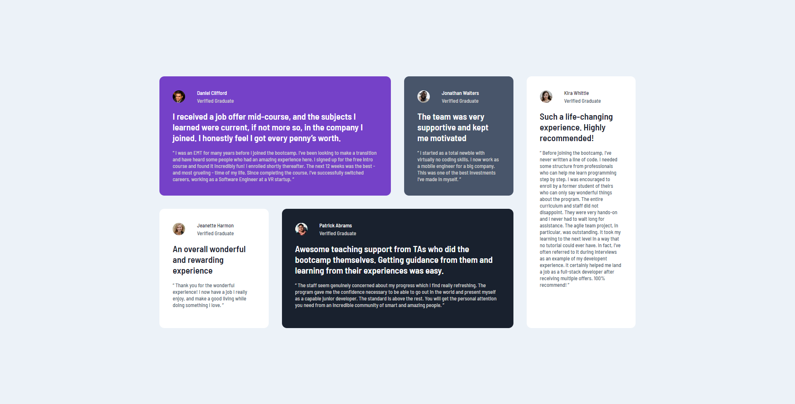

# Frontend Mentor - Testimonials grid section solution

This is a solution to the [Testimonials grid section challenge on Frontend Mentor](https://www.frontendmentor.io/challenges/testimonials-grid-section-Nnw6J7Un7). Frontend Mentor challenges help you improve your coding skills by building realistic projects. 

## Table of contents

- [Overview](#overview)
  - [The challenge](#the-challenge)
  - [Screenshot](#screenshot)
  - [Links](#links)
- [My process](#my-process)
  - [Built with](#built-with)
  - [What I learned](#what-i-learned)
- [Author](#author)

**Note: Delete this note and update the table of contents based on what sections you keep.**

## Overview

### The challenge

Users should be able to:

- View the optimal layout for the site depending on their device's screen size

### Screenshot

### Links

- Solution URL: [Site](https://www.frontendmentor.io/solutions/testimonials-section-with-css-grid-YTFXbOPGBj)
- Live Site URL: [Site](https://testminonialgridfm.netlify.app/)

## My process

### Built with

- HTML5
- CSS custom properties
- Flexbox
- Mobile-first workflow
- Grid

### What I learned

I learned a bit of mobile firsts design and css grid. Css Grid is fun :o

## Author

- Frontend Mentor - [@Alenayc-Git](https://www.frontendmentor.io/profile/Alenayc-Git)
